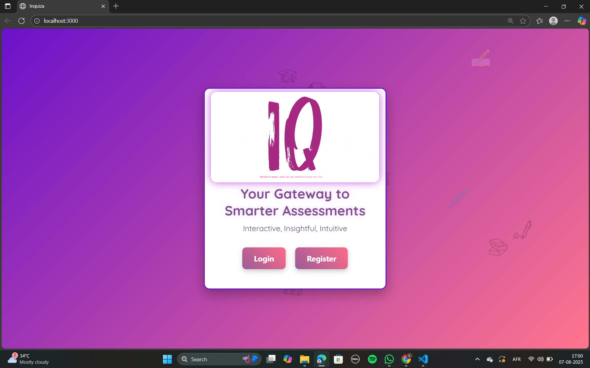
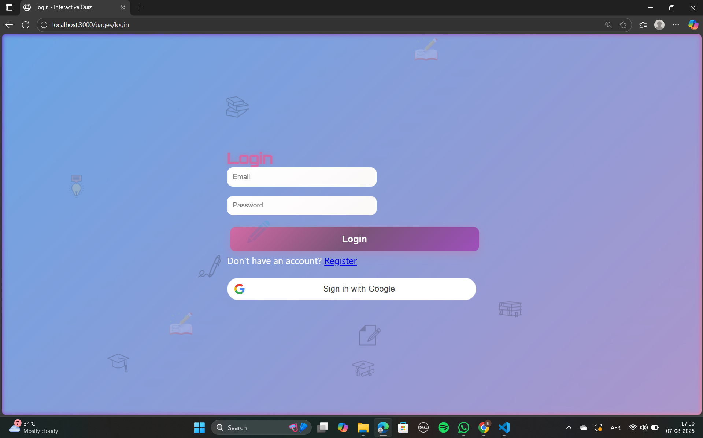
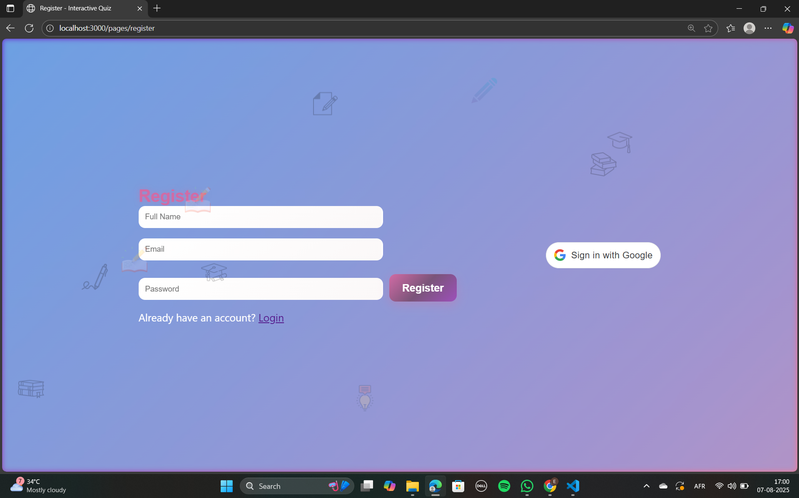
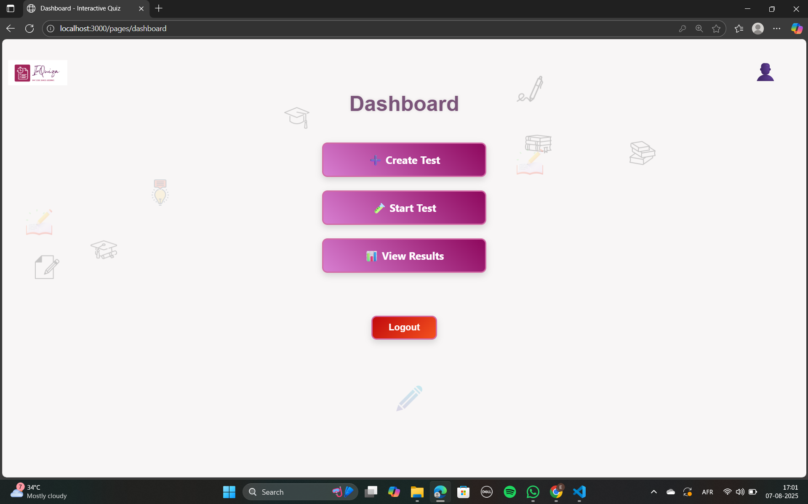
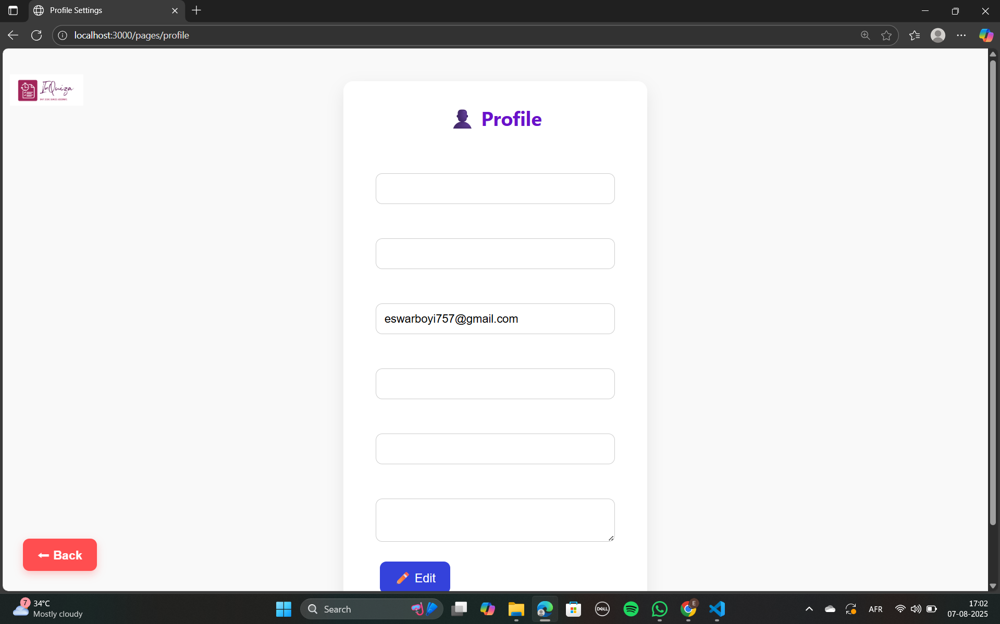
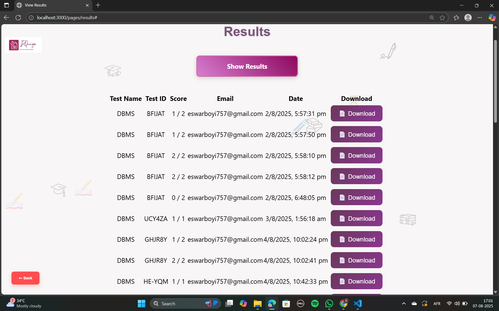
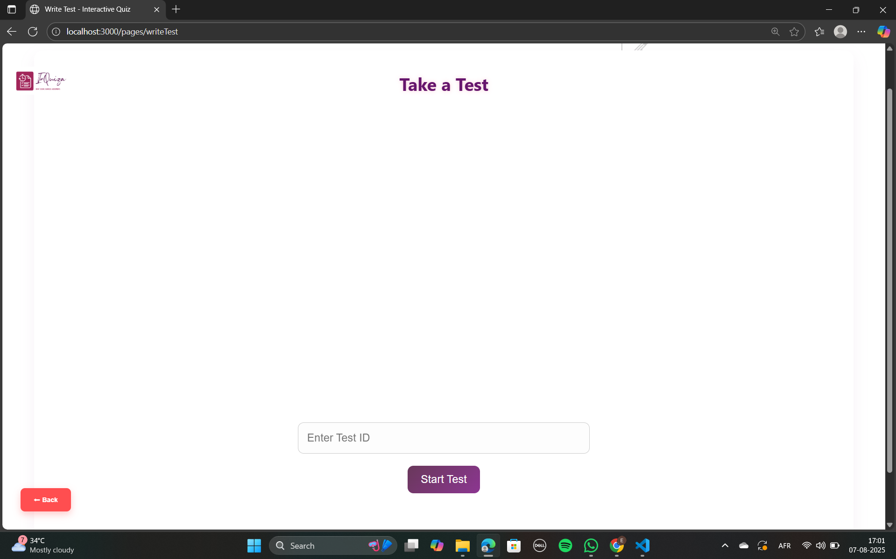
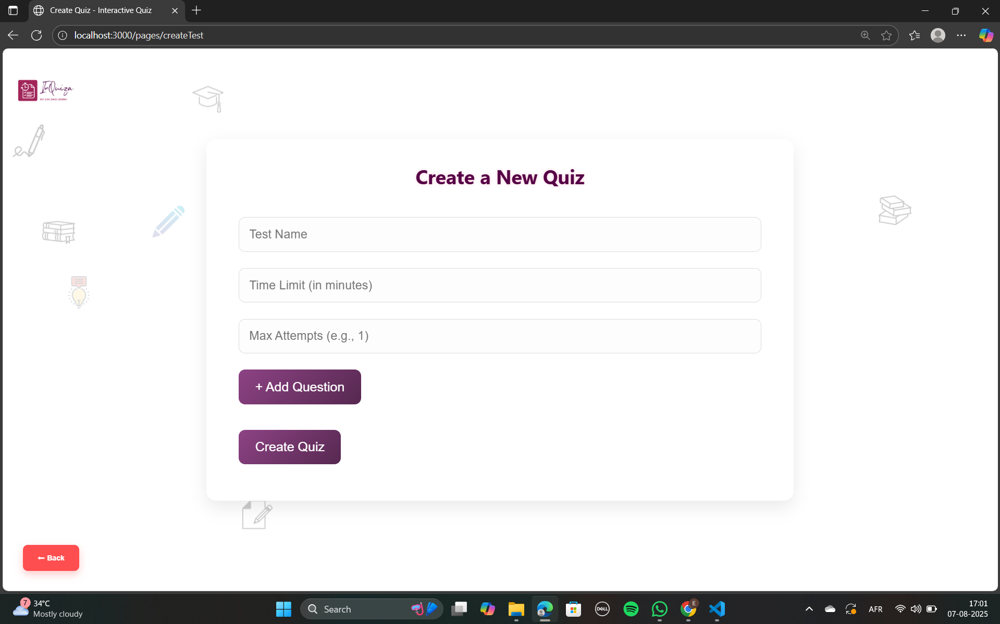

#  InQuiza - Interactive Quiz Web App

An interactive full-stack quiz system where:
-  Admins can create custom quizzes with questions, hints, images, and constraints.
-  Users can take quizzes using test IDs or shareable links, view results, and download full PDF scorecards.
-  All results are stored, visible in a dashboard, and restricted by attempt limits.

---

## Features

### User Authentication
- User registration/login via email + password
- Google Sign-In using OAuth2
- Session maintained via JWT tokens

### Test Creation (Admin Side)
- Create custom tests with:
  - Dynamic number of questions
  - Question types: Multiple Choice (MCQ), True/False, Blank
  - Dynamic options
  - Hints per question
  - Optional image upload
  - Score per question
  - Time limit per test
  - Max number of attempts per user

- Generates a **unique Test ID**
- Shareable link for easy distribution

### Writing Tests (User Side)
- Enter Test ID or visit shared test link
- View one question at a time with:
  - Navigation: **Next/Previous**
  - Display of question image and hint (if provided)
  - Timer countdown (auto-submit on timeout)
  - Support for MCQ, True/False, Blank answers

### Results & Dashboard
- After submission:
  - Score is calculated
  - Answers are saved
  - Result is shown immediately
  - Attempt limits enforced
- Results saved in MongoDB Atlas
- Results shown in dashboard (per user)
- Quiz creator receives a copy of each submission

### PDF Scorecard
- Downloadable from dashboard after submission
- Contains:
  - User info (name, email)
  - Test ID and name
  - Attempt date
  - Score

---

## Technologies Used

- **Frontend**: HTML, CSS, JavaScript
- **Backend**: Node.js, Express
- **Database**: MongoDB Atlas
- **Authentication**: JWT, Google OAuth2
- **PDF Generation**: jsPDF + html2canvas
- **File Upload**: Base64 (images embedded)
- **Deployment**: Render / Vercel / Netlify (user choice)

---

## Setup Instructions

### 1. Clone the Repo

```bash
git clone [https://github.com/yourusername/interactive-quiz.git](https://github.com/22BCE8093-Eswar/Interactive-Quiz)
cd interactive-quiz
```

### 2. Install Dependencies
```bash
cd backend
npm install
```

### 3. Setup Environment Variables
Create .env inside backend/:
```bash
PORT=5000
MONGODB_URI=your_mongodb_connection_string
JWT_SECRET=your_jwt_secret_key
GOOGLE_CLIENT_ID=your_google_client_id
```

### 4. Run Server
```bash
npm start
```
Server will run on: http://localhost:5000

### 5. Run Frontend
You can open frontend/index.html directly in browser or host it using:
Live Server (VS Code)

Netlify / Vercel for deployment

### Environment Variables Explained
Variable	Description
PORT	Backend server port
MONGODB_URI	MongoDB Atlas connection string
JWT_SECRET	Secret for signing JWT tokens
GOOGLE_CLIENT_ID	Google OAuth2 client ID for Google Sign-In

### Screenshots
### Home Page
                                 

### Login Page                                                                                  ### Register Page
                                       

### Dashboard                                                                                   ### Settings Page
                                   


### Result Page


### Write Test Page


### Create Test Page



### Example Test Flow
Admin logs in → Creates Test → Gets Test ID or shareable link

User logs in → Enters Test ID → Answers questions one-by-one

Timer (if set) counts down

User submits test → Result shown → Saved to DB

Dashboard displays user's past results

PDF download enabled from results page

### Access Control
All actions require login.
Backend endpoints protected with JWT auth.
Test attempt limits enforced per user.
Google Sign-In tokens verified on backend.

### Result Notification to Creator
After test submission:
The result (score + answers) is sent to test creator’s email or logged in backend (based on your email setup).

### Test Question Types
1. Multiple Choice (MCQ)
2. True / False
3. Blank (text input)

Each supports:
Optional hint

Optional image

📜 License
MIT License
Eswar Reddy Boyi

Your GitHub Username

📞 Contact
Have questions or need help?

📧 Email: eswarboyi7@gmail.com
🌐 GitHub: [https://github.com/yourusername](https://github.com/22BCE8093-Eswar)


